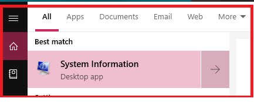
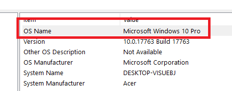
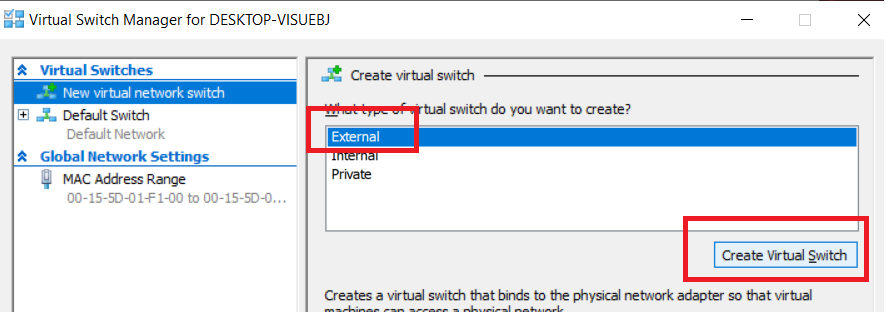

## Openshift 3.* on your Windows 10 pro machine

Windows 10 pro laptopPre-requisites:
1. Windows 10 Pro   
2. 16GB of RAM   
3. SSD hard drive   
4. multi-core processor (8 preferrable but not necessdary)   

High Level oveview:   
1. Verify your running Windows 10 PRO or Upgrade windows 10 Home to windows 10 PRO:   
   * search for `System` and in the search window.            
          

             
   
2. Install and configure HyperV  on Windows 10 Pro
   * Turn on HyperV on Windows 10 Pro
     `control panel --> Programs --> Turn Windows Features on or off`
        
   
   * add your id to the HyperVisor Admnistrators Group via PowerShell:
     * run powershell as admninistrator   
            
     * Via Powershell add yourself to the Hyperv administrators group:   
     ```
     ([adsi]”WinNT://./Hyper-V Administrators,group”).Add(“WinNT://$env:UserDomain/$env:Username,user”)
     ```   
         
   * create external virtual switch via HypeVadmin on your Ethernet adapter NOT wireless adapter.
    ***You may have to apply the following fix if the Virtual Switch creation errors out: [Virtual Switch Creation Error fix](https://support.microsoft.com/en-us/help/3101106/you-cannot-create-a-hyper-v-virtual-switch-on-64-bit-versions-of-windo) ***
   
           
          
             
   
              
      
     ***make sure to add the virtual switch against your Eternet network adapter and not your wifi adapter***    
            

3. Download and start minishift with the following switches   
   * from where you downloaded and extract minishift   
   * start a powershell command window as administrator
           
   * cd to where you downloaded and extracted minishift      
   ```powershell
   c:\usr\minishift\minishift.exe start --hyperv-virtual-switch "minishiftvswitch" --memory 8GB
   ```      
   
output:   
```powershell
-- Starting profile 'minishift'
,,,,,,,
Login to server ...
Creating initial project "myproject" ...
Server Information ...
OpenShift server started.

The server is accessible via web console at:
    https://192.168.1.215:8443/console

You are logged in as:
    User:     developer
    Password: <any value>

To login as administrator:
    oc login -u system:admin


-- Exporting of OpenShift images is occuring in background process with pid 10376.
PS C:\Windows\system32>
```
